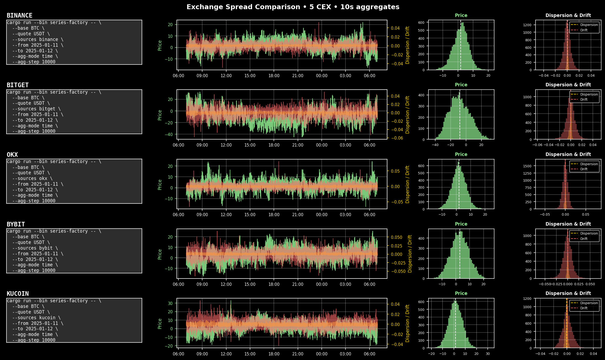
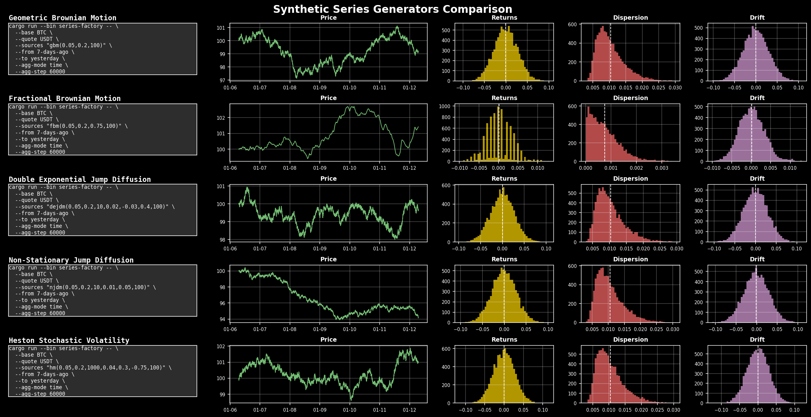

<div align="center">
  
  <h1>Series Factory</h1>
  <p>
    <strong>Historical & synthetic time series aggregator</strong>
  </p>
  <p>
    <!-- <a href="https://btr.supply/docs"></a> -->
    <a href="./LICENSE"></a>
    <a href="https://t.me/BTRSupply"></a>
    <a href="https://twitter.com/BTRSupply"></a>
    </p>
</div>

Fetch data from high quality data sources or generate fresh test data using stochastic models, cleanse and aggregate at speed.

## Table of Contents
- [Features](#features)
- [Installation](#installation)
- [Data Sources](#data-sources)
- [Generative Models](#generative-models)
- [Usage](#usage)
- [Series Aggregation Methodology](#series-aggregation-methodology)
- [Performance](#performance)
- [Output Format](#output-format)
- [Caching Strategy](#caching-strategy)
- [Architecture](#architecture)
- [Examples](#examples)

## Features

- **Multiple Data Sources**: Support for 5+ CEX exchanges and synthetic generators.
- **Aggregation Methods**: Time-based and tick-based aggregation with customizable parameters.
- **Advanced Analytics**: Velocity, dispersion, and drift calculations per aggregate.
- **Generative Models**: GBM, FBM, Heston, NJDM, and DEJDM for synthetic data generation.
- **High Performance**: Multi-threaded processing with async I/O, targeting <60s for 1 month of data.
- **Intelligent Caching**: Three-tier caching system for optimal performance.
- **Data Quality**: Automatic filtering of stale and deviated ticks.
- **Parquet Output**: Compressed columnar format optimized for time-series queries.

## Data Sources

### Supported Exchanges

| Exchange | ID | Data Format | History From | Notes |
|----------|----|-------------|--------------|-------|
| Binance | `binance` | ZIP/CSV | 2017 (monthly), 2021 (daily) | Monthly files for completed months, daily for current month |
| Bybit | `bybit` | GZIP/CSV | 2019 | Monthly files for completed months, daily for current month |
| Bitget | `bitget` | ZIP/CSV | 2021 | Daily files, sequential chunks (001-N) |
| OKX | `okx` | ZIP/CSV | 2021 | Daily files, dash-separated symbols (BTC-USDT) |
| KuCoin | `kucoin` | ZIP/CSV | 2020 | Daily files |

### Exchange Comparison

<div align="center">
  
</div>

The chart above shows price spread, dispersion spread, and drift spread across 5 major CEX exchanges for BTC-USDT with 10-second aggregation.

## Installation

```bash
cargo build --release
```

## Usage

### Basic Syntax

```bash
./target/release/series-factory [OPTIONS]
```

### CLI Parameters

| Parameter | Description | Default |
|-----------|-------------|---------|
| `--base` | Base asset (e.g., "BTC") | "BTC" |
| `--quote` | Quote asset (e.g., "USDT") | "USDT" |
| `--sources` | Pipe-separated data sources (e.g., "binance\|bybit") or generative model | "binance" |
| `--from` | Start date (YYYY-MM-DD) | Required |
| `--to` | End date (YYYY-MM-DD or "now") | Required |
| `--agg-mode` | Aggregation method ("time" or "tick") | "time" |
| `--agg-step` | Aggregation step (ms for time, ratio for tick) | Required |
| `--agg-fields` | Pipe-separated fields to include in output | All fields |
| `--weight-mode` | Weighting mode ("static", "volume", or "mixed") | "static" |
| `--weights` | Pipe-separated static weights (auto-normalized) | Equal weights |
| `--tick-ttl` | Tick time-to-live in milliseconds for staleness check | 100 |
| `--tick-max-deviation` | Maximum tick deviation ratio for outlier filtering. | 0.001 (0.1%) |
| `--out-format` | Output file format. | "parquet" |
| `--cache-dir` | Cache directory. | "./cache" |
| `--output-dir` | Output directory. | "./output" |

### Aggregation Step Interpretation

- **Time mode**: `agg_step` is in milliseconds (e.g., 1000 = 1 second aggregation)
- **Tick mode**: `agg_step` is a price ratio (e.g., 0.0001 = 0.01% price movement triggers new aggregate)

## Series Aggregation Methodology

The process of creating aggregated series involves several steps, from raw trade data to final analyzed aggregates.

### Step 1: Trades to Tick Conversion

#### 1.1 Raw Trades to Aggregated Trades
Most trusted data sources (e.g., Binance) provide pre-aggregated trades. For sources providing only raw trades, an initial aggregation step sums all trades that lead to a price change. This repository currently relies on sources that provide aggregated trades or ticks.

#### 1.2 Aggregate Trades to Ticks
Aggregate trades are converted to ticks using the following logic:
- **Market sells** (buyer maker): Price becomes bid, previous ask is forward-filled
- **Market buys**: Price becomes ask, previous bid is forward-filled
This method is a pessimistic but reliable reading of the spread, ensuring better model robustness.

The resulting tick structure:
```rust
Tick {
    timestamp: i64,  // milliseconds since epoch
    bid: f64,        // bid price
    ask: f64,        // ask price
    vbid: u32,       // volume at bid in USD*
    vask: u32,       // volume at ask in USD*
}
```

**Note**: When using multiple data sources (e.g., `--sources="binance|bybit"`), each source's ticks are aggregated separately and then merged at the aggregate level. Source identity is tracked implicitly through separate aggregation pipelines, not stored on individual ticks.

### Step 2: Optional Triangular Re-basing

For synthetic pairs (e.g., BTC-ETH), the system uses the most liquid USDT denominated pairs to construct the series.

#### 2.1 Data Source Characteristics

All supported exchanges provide downloadable historical trade data via public data lakes:

- **Binance**: Monthly ZIP files from 2017, daily files from 2021. Automatically uses daily data for the current/ongoing month since monthly files are not yet available.
- **Bybit**: Monthly GZIP files from 2019, with daily files for the current month
- **OKX**: Daily ZIP files from 2021, dash-separated symbols (BTC-USDT)
- **KuCoin**: Daily ZIP files from 2020
- **Bitget**: Daily ZIP files from 2021, sequential chunks (001-N)

#### 2.2 Triangulation
Time-based forward filling is used to merge the USDT pairs into a single intermediate synthetic series.

#### 2.3 Volume Re-basing
To make volumes comparable, they are denominated in USD*. For synthetic pairs, the volume is estimated using the arithmetic mean of the constituent pair volumes to avoid overstating liquidity.

### Step 3: Ticks to Aggregates

The final step is to compute aggregates from the intermediate ticks. An aggregate is a bucket of ticks, created based on either time or price movement.

```rust
Aggregate {
    timestamp: i64,      // milliseconds since epoch (bucket close time)
    open: f64,          // first tick mid price in bucket
    high: f64,          // highest mid price in bucket  
    low: f64,           // lowest mid price in bucket
    close: f64,         // last tick mid price in bucket
    mid: f64,           // volume-weighted average price (VWAP)
    spread: f32,        // average spread as ratio
    vbid: u32,          // cumulative bid volume
    vask: u32,          // cumulative ask volume
    velocity: f32,      // sqrt(tick_count) - activity measure
    dispersion: f32,    // normalized price std dev - volatility measure
    drift: f32,         // normalized regression slope - trend measure
}
```

#### Aggregation Modes

##### Time-Based Aggregation (Candles)
- **Trigger**: A new aggregate bucket is created when `timestamp >= prev_timestamp + agg_step`
- **Behavior**: Creates traditional OHLC candlesticks with fixed time intervals
- **Use Case**: Standard time-series analysis, consistent sampling rate
- **Gap Handling**: Empty buckets create flat candles at the last known price

##### Price-Based Aggregation (Renko-like Bricks)
- **Trigger**: A new aggregate bucket is created when price moves beyond `prev_close * (1 ± agg_step)`
- **Behavior**: Creates bricks similar to Renko charts but with wicks (high/low)
- **Use Case**: Noise reduction, trend following, volatility-normalized analysis
- **OHLC Interpretation**: Shows the price path taken to trigger the brick close

#### Data Quality Filtering
- **Stale Ticks**: Ticks older than `tick_ttl` are excluded from the aggregate's mid-price and spread calculations.
- **Deviated Ticks**: Ticks with a mid-price deviating more than `tick_max_deviation` from the current aggregate mid-price are filtered out.
- **Volume Integrity**: To avoid double-counting and lookahead bias, only the volumes of ticks within the current aggregate bucket are counted towards `vask` and `vbid`. Prices can be forward-filled from previous ticks (if not stale), but volumes are not.

### Step 4: Aggregate Analytics

For each aggregate bucket, several analytical metrics are computed.

#### 4.1 Velocity Calculation
Velocity represents the activity level within a bucket. It's a non-linear measure that compresses high-frequency periods, helping to normalize extreme activity spikes.
```
velocity = sqrt(tick_count)
```

#### 4.2 Dispersion Calculation
Dispersion measures price scatter around the trend line within the bucket, indicating volatility relative to the directional movement. It uses linear regression to establish the trend, then calculates deviations from that trend line. This ensures that aligned upward/downward movements result in low dispersion even with price changes.
```
1. Calculate linear regression of mid_prices vs time
2. dispersion = (stddev(deviations_from_regression_line) / mean(mid_prices)) * 100
```
Expressed as percentage for comparability across different price levels and assets.

#### 4.3 Drift Calculation  
Drift captures the trend strength within the bucket as a percentage of the closing price. It uses the same linear regression as dispersion to calculate the slope, then expresses the total change over the time period as a percentage of the final price.
```
1. Calculate linear regression slope (price_change_per_second)
2. total_change = slope * time_duration_seconds
3. drift = (total_change / close_price) * 100
```
Expressed as percentage for comparability across different price levels and time periods.

## Generative Models

The factory can generate synthetic series using several stochastic process models. The model and its parameters are passed as a string to the `--sources` argument.

**IMPORTANT**: All synthetic data uses a fixed 500ms epoch (one tick every 500 milliseconds). All time-related parameters are specified on a **yearly basis** and automatically converted to per-epoch values by the system.

### Available Models

| Model | ID | Parameters | Description |
|-------|----|------------|-------------|
| Geometric Brownian Motion | `gbm(...)` | `mu, sigma, base` | Continuous stochastic process with drift |
| Fractional Brownian Motion | `fbm(...)` | `mu, sigma, hurst, base` | BM with long-range dependence (Hurst parameter) |
| Heston Stochastic Volatility | `hm(...)` | `mu, sigma, kappa, theta, xi, rho, base` | Volatility follows mean-reverting process |
| Normal Jump-Diffusion | `njdm(...)` | `mu, sigma, lambda, mu_jump, sigma_jump, base` | GBM + normally distributed jumps |
| Double Exp. Jump-Diffusion | `dejdm(...)` | `mu, sigma, lambda, mu_pos, mu_neg, p_neg, base` | GBM + asymmetric exponential jumps |

### Model Comparison

<div align="center">
  
</div>

### Time Parameters Conversion
- **Epochs per year**: ~63,115,200 (calculated as 365.25 × 24 × 60 × 60 × 1000 ÷ 500)
- **Parameter conversion**:
  - Drift rates: `yearly_mu / epochs_per_year`
  - Volatilities: `yearly_sigma / sqrt(epochs_per_year)`
  - Frequencies: `yearly_lambda / epochs_per_year`

### Geometric Brownian Motion (GBM)
A continuous-time stochastic process where the logarithm of the randomly varying quantity follows a Brownian motion with drift.
```
gbm(mu, sigma, base)
```
- `mu`: **Yearly** drift rate (e.g., 0.05 for 5% annual drift)
- `sigma`: **Yearly** volatility (e.g., 0.2 for 20% annual volatility)
- `base`: Starting price

Example: `gbm(0.05,0.2,100.0)`

### Fractional Brownian Motion (FBM)
An extension of Brownian motion with a Hurst parameter `h` that models long-range dependence.
```
fbm(mu, sigma, hurst, base)
```
- `mu`: **Yearly** drift rate
- `sigma`: **Yearly** volatility magnitude
- `hurst`: Hurst parameter (0-1)
  - `h = 0.5`: Standard Brownian motion
  - `h > 0.5`: Persistent behavior (trends)
  - `h < 0.5`: Anti-persistent behavior (mean-reverting)
- `base`: Starting price

Example: `fbm(0.05,0.2,0.75,100.0)`

### Heston Stochastic Volatility Model
Volatility itself follows a random process, mean-reverting to a long-term average.
```
hm(mu, sigma, kappa, theta, xi, rho, base)
```
- `mu`: **Yearly** drift rate
- `sigma`: **Yearly** initial volatility
- `kappa`: Mean reversion speed for volatility
- `theta`: Long-term average volatility
- `xi`: Volatility of volatility
- `rho`: Price-vol correlation (-1 to 1)
- `base`: Starting price

Example: `hm(0.05,0.2,1000,0.04,0.3,-0.75,100.0)`

### Normal Jump-Diffusion Model (NJDM)
Combines GBM with discrete jumps at random intervals (normally distributed jump sizes).
```
njdm(mu, sigma, lambda, mu_jump, sigma_jump, base)
```
- `mu`: **Yearly** drift rate
- `sigma`: **Yearly** diffusion volatility
- `lambda`: **Yearly** jump frequency (jumps per year)
- `mu_jump`: Mean jump size (as fraction)
- `sigma_jump`: Jump size standard deviation
- `base`: Starting price

Example: `njdm(0.05,0.2,10,0.01,0.05,100.0)`

### Double Exponential Jump-Diffusion Model (DEJDM)
GBM with asymmetric positive/negative jumps (exponentially distributed).
```
dejdm(mu, sigma, lambda, mu_pos_jump, mu_neg_jump, p_neg_jump, base)
```
- `mu`: **Yearly** drift rate
- `sigma`: **Yearly** diffusion volatility
- `lambda`: **Yearly** jump frequency
- `mu_pos_jump`: Mean positive jump size
- `mu_neg_jump`: Mean negative jump size (negative value)
- `p_neg_jump`: Probability of negative jump (0-1)
- `base`: Starting price

Example: `dejdm(0.05,0.2,10,0.02,-0.03,0.4,100.0)`

## Performance

### Requirements
- Process 1 month of tick data (500M-1B ticks) in under 60 seconds.
- Memory usage < 2GB for processing 1 month of data.
- Support for future real-time streaming mode.

### Optimizations
- **Concurrency**: Tokio for async I/O, Rayon for parallel CPU-bound tasks.
- **Parallelism**: Concurrent processing of multiple data sources.
- **Streaming**: Process data in configurable monthly batches to optimize memory.
- **Memory efficiency**: No full dataset loading, lazy evaluation where possible.
- **Lock-free structures**: Used where possible for efficient inter-thread communication.

## Output Format

### Parquet Schema
Files are stored in Apache Parquet format with Snappy compression. Data is partitioned by date for efficient range queries.

| Field | Type | Description |
|-------|------|-------------|
| timestamp | i64 | Aggregate close time (end of bucket) in milliseconds since epoch |
| open | f64 | Opening price (first tick mid in bucket) |
| high | f64 | Highest price reached in bucket |
| low | f64 | Lowest price reached in bucket |
| close | f64 | Closing price (last tick mid in bucket) |
| mid | f64 | Volume-weighted average price (VWAP), legacy field same as close |
| spread | f32 | Average spread as ratio of mid price |
| vbid | u32 | Cumulative bid volume in USD* |
| vask | u32 | Cumulative ask volume in USD* |
| velocity | f32 | Activity measure: `sqrt(tick_count)` |
| dispersion | f32 | Volatility measure: price scatter around trend (%) |
| drift | f32 | Trend measure: directional movement strength (%) |

### File Naming
The output file name is structured to reflect its contents:
```
{base}-{quote}_{sources}_{from}-{to}_{agg_mode}-{agg_step}.parquet
```
Example: `btc-usdt_binance_20250720-20250721_time-5000.parquet`

Generation parameters, data sources, and other metadata are stored in the Parquet file properties for traceability.

### Data Preview
The application automatically displays a formatted table showing the first and last 10 rows of generated data:
- **Timestamp format**: YYYYMMDD HH:MM:SS.fff (e.g., 20250720 14:30:15.500)
- **Percentage metrics**: Dispersion and drift displayed as percentages for immediate interpretation
- **Summary statistics**: Average price, spread, and total volume
- **Data quality**: First tick always has non-zero bid and ask values

## Caching Strategy

A three-tier caching system is used to minimize redundant computations and data downloads.

### Three-Tier Cache Hierarchy

#### 1. Raw Data Cache (`./cache/raw/`)
- Stores originally downloaded exchange data files (e.g., ZIP/CSV).
- Structure: `{exchange}/{symbol}/{year}/{month}/`
- Default retention: 30 days.

#### 2. Tick Cache (`./cache/ticks/`)
- Stores raw data converted to a unified tick format (Parquet).
- Structure: `{exchange}/{symbol}/{year}/{month}/`
- Schema: timestamp, bid, ask, vbid, vask.

#### 3. Aggregate Cache (`./cache/aggregates/`)
- Stores pre-computed aggregates for common parameter sets.
- Structure: `{sources_hash}/{params_hash}/{year}/{month}/`
- Allows rapid regeneration of output when only output fields change.

### Cache Management
- Content-based hashing (SHA-256) for cache keys ensures integrity.
- Automatic cleanup of stale cache entries.
- Configurable cache size limits with LRU eviction policy.

## Architecture

### Module Structure
- `sources/`: Data source implementations (Binance, synthetic models).
- `aggregation/`: Core aggregation engine.
- `cache/`: Three-tier caching system.
- `output/`: Parquet file generation.
- `types/`: Core data structures (e.g., Tick, Aggregate).
- `cli/`: Command-line interface parsing and handling.

### Key Design Principles
- **Modular**: Easily extensible for new data sources and models.
- **Memory Safe**: Zero-copy operations and careful memory management.
- **Error Handling**: Comprehensive error types with context via `thiserror`.
- **Async/Await**: Non-blocking I/O operations for network and file access.
- **Type Safety**: Strong typing throughout the application to prevent errors.

## Examples

### Exchange Data with Time Aggregation
```bash
# Fetch BTC/USDT from Binance with 5-second aggregation
./target/release/series-factory \
    --sources="binance" \
    --from="2025-07-20" \
    --to="2025-07-21" \
    --agg-mode="time" \
    --agg-step=5000
```

### Synthetic Data Generation
```bash
# Generate Heston model data aggregated into 1-minute buckets
./target/release/series-factory \
    --sources="hm(0.0001,0.001,1000,0.001,0.001,-0.75,100.0)" \
    --from="2025-01-01" \
    --to="2025-12-31" \
    --agg-mode="time" \
    --agg-step=60000
```

### Tick-Based Aggregation
```bash
# Aggregate on 0.1% price movements
./target/release/series-factory \
    --sources="binance" \
    --from="2025-07-20" \
    --to="2025-07-21" \
    --agg-mode="tick" \
    --agg-step=0.001
```

### Multiple Sources (Combined Data)

Fetch from multiple exchanges simultaneously. All ticks are combined and sorted chronologically.

```bash
# Combine data from Bybit and OKX
./target/release/series-factory \
    --sources="bybit|okx" \
    --from="2025-01-11" \
    --to="2025-01-12" \
    --agg-mode="time" \
    --agg-step=10000

# Combine all 5 supported exchanges
./target/release/series-factory \
    --sources="binance|bybit|okx|kucoin|bitget" \
    --from="2025-01-11" \
    --to="2025-01-12" \
    --agg-mode="time" \
    --agg-step=10000
```

**Note**: When combining multiple sources, use `--weights` to assign custom weights. Weights are auto-normalized so they don't need to sum to 1.0. For example, `--weights="2|1"` gives the first source 2x the influence of the second.

## Testing

Run the test suite:
```bash
./test.sh
```

This validates both synthetic data generation and exchange data fetching.

## Dependencies

- `tokio`: Async runtime for I/O operations
- `rayon`: Data parallelism for CPU-intensive tasks
- `arrow`/`parquet`: Columnar data format
- `reqwest`: HTTP client for data downloads
- `chrono`: Date/time handling
- `clap`: CLI argument parsing
- `nalgebra`: Linear algebra operations
- `statrs`: Statistical functions

## License

This project is licensed under the MIT License - see the [LICENSE](LICENSE) file for details.

## Contributing

We welcome contributions! Please see our [Contributing Guide](CONTRIBUTING.md) for details on:
- How to submit bug reports and feature requests
- Development setup and guidelines
- Code style and testing requirements
- Pull request process

For major changes, please open an issue first to discuss what you would like to change.
